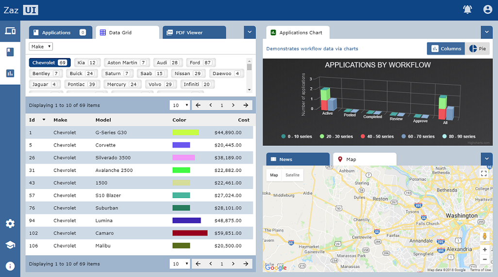

## PeroZ Framework

#### Based on another open source framwork, this framework aims to provide zero config starting point for writing simple self contained components to do data engineering with. Many pre built samples are being added so that startup and as simple as can be

Original Notes Below
--

About - [Download](./markdown/DOWNLOAD.md) - [Configure](./markdown/CONFIGURE.md) - [Develop](./markdown/DEVELOP.md) - [Messaging](./markdown/MESSAGING.md)  - [Fullstack](./markdown/FULLSTACK.md) - [Components](./markdown/COMPONENTS.md) - [Bootstrapping](./markdown/BOOTSTRAPPING.md)

### About Zaz UI Development Platform [Community Edition]
Zaz UI Platform

#### Driven by a Team of Passionate Enterprise professionals, having realized a constant need for reusable, cost effective, rich user interface and experience, pursued to fill this unique gap in the market. The result is Zaz UI Development Platform. Developed over 6 years, the team has built State of the art UI platform based on jQuery's Widget Factory.

