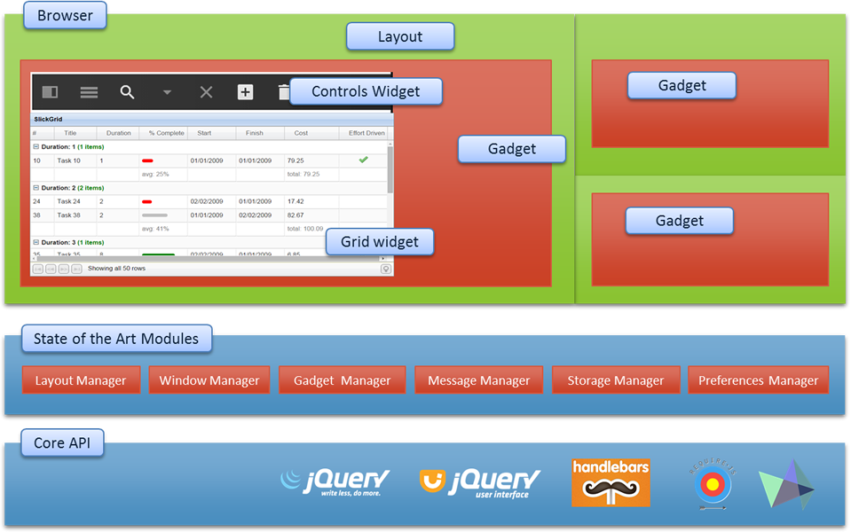

[About](../../../) - [Download](DOWNLOAD.md) - [Bootstrapping](BOOTSTRAP.md) - [Configure](CONFIGURE.md) - [Develop](DEVELOP.md) - [Messaging](MESSAGING.md) - [Fullstack](FULLSTACK.md) - Components - [Bootstrapping](BOOTSTRAPPING.md)

# Core Components 

*Zaz UI* leverages several open source projects.  

> Core runtime components are Require, jQuery Core, jQuery UI Widget Factory and Zaz UI Framework files. 

> In addition there are components that are used only during development as shown below.    

    ...
        "grunt": "^0.4.5",
        "grunt-concurrent": "^0.4.1",
        "grunt-connect-proxy": "0.1.4",
        "grunt-contrib-connect": "^0.9.0",
        "grunt-contrib-handlebars": "^1.0.0",
        "grunt-contrib-requirejs": "^1.0.0",
        "grunt-contrib-watch": "^0.6.1",
        "grunt-newer": "^1.3.0",
        "grunt-sass": "^2.0.0",
        "grunt-war": "0.4.8",
        "matchdep": "^0.3.0",
        "replace": "^0.3.0",
        "time-grunt": "^1.1.1"
    ...

