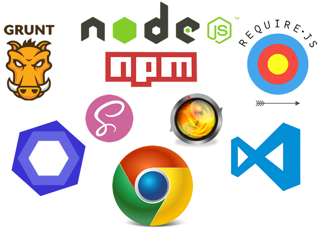

[About](../../../) - [Download](DOWNLOAD.md) - [Bootstrapping](BOOTSTRAPPING.md) - [Configure](CONFIGURE.md) - [Develop](DEVELOP.md) - [Messaging](MESSAGING.md) - Fullstack - [Components](COMPONENTS.md)

# Fullstack NodeJS based Platform 

Zaz UI local development is based on `NodeJS` and proxying to REST Services using `Heroku` DEVOPS/`AWS` which in turn leverages `Mongoose` driver to connect to `MLAB` for `MongoDB` no-sql store.  

> Incorporates `Handlebars` for templating, `SASS` for effective CSS styles management.    

> Leverages Live Reload the built intp `grunt-contrib-connect` plug-in to run locally on workstation with ability to proxy to higher environments to consume data and services along side `watch` task manager which increases developer efficiency.

Recommended tool are Chrome DEV Tools for debugging and VS Code as IDE. Though these are not mandatory.    

