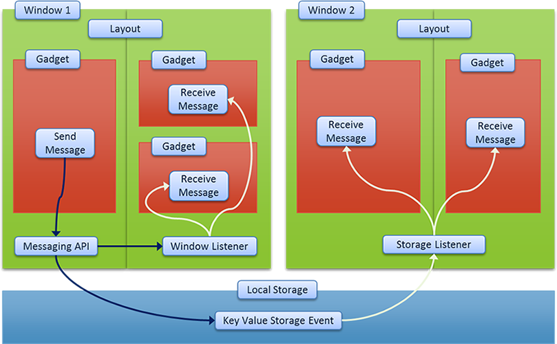

[About](../../../) - [Download](DOWNLOAD.md) - [Bootstrapping](BOOTSTRAPPING.md) - [Configure](CONFIGURE.md) - [Develop](DEVELOP.md) - Messaging - [Fullstack](FULLSTACK.md) - [Components](COMPONENTS.md)

# Cross window/gadget messaging API

Zaz UI uses HTML5 local storage event mechanism to listen to messages if other web applications are hosted on the same domain and use local storage. In enterprise edition, it is used to communicate between all child windows and gadgets/features on widnows with main console. This allows the API to be significantly smaller. The spec has been well adopted by all browsers.  

